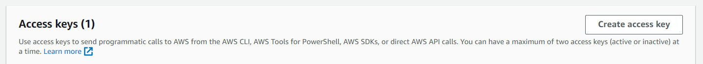
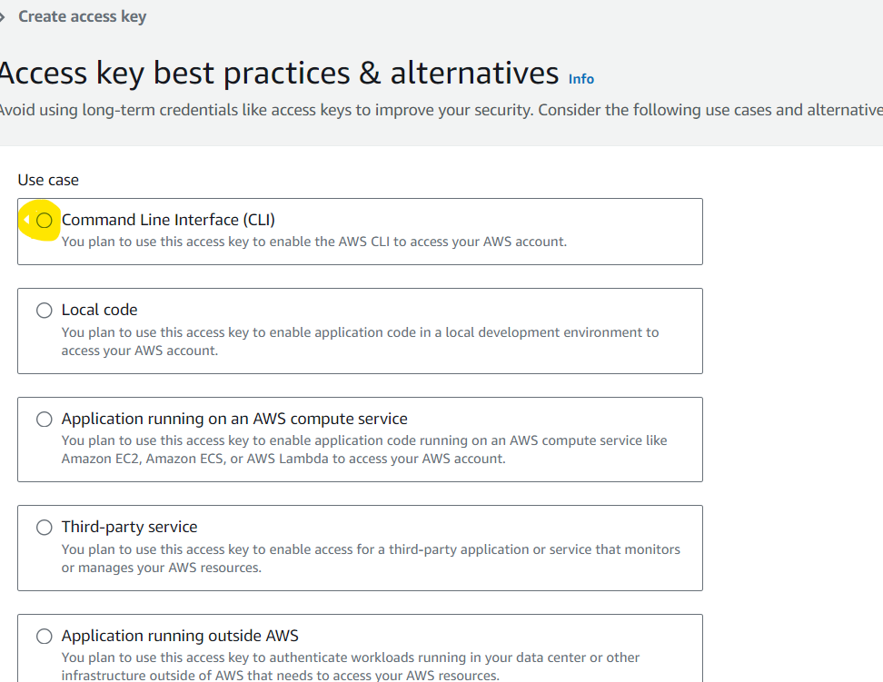
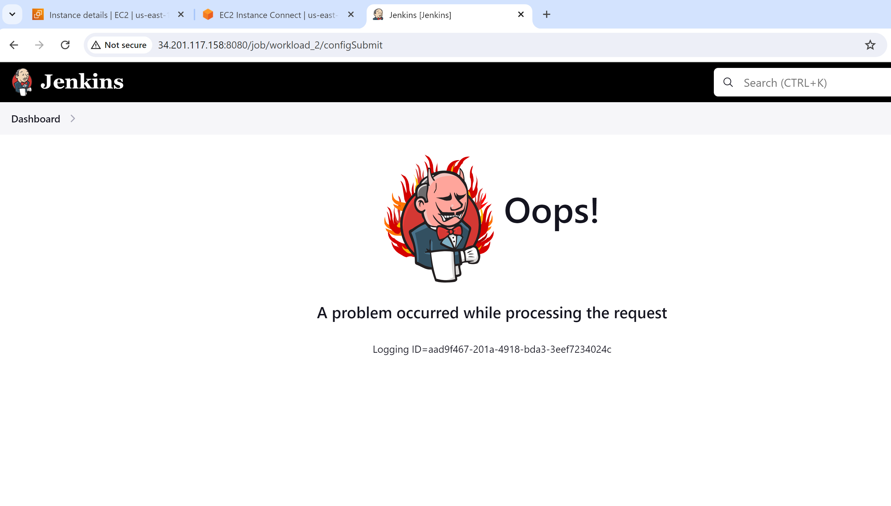
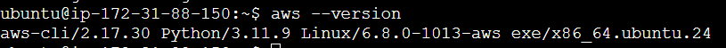

##CICD with AWS CLI

## Table Of Contents

- [PURPOSE](#purpose)
- [STEPS And Why each was Necessary](#the-steps-taken-and-why-each-was-necessaryimportant)
- [SYSTEM DESIGN DIAGRAM](#system-design-diagram)
- [ISSUES and TROUBLESHOOTING](#issuestroubleshooting)
- [OPTIMIZATION](#optimization)
- [CONCLUSION](#conclusion)

### PURPOSE

The purpose of this worload was to effectively automate the process of deploying an application using the AWS CLI.


### The "STEPS" taken (and why each was necessary/important)

1. First Step, add all source code into GitHub Repository

2. Create AWS Access Keys:

   a. Navigate to the AWS servce: IAM (search for this in the AWS console)

   b. Click on "Users" on the left side navigation panel

   c. Click on your User Name

   d. Underneath the "Summary" section, click on the "Security credentials" tab

   e. Scroll down to "Access keys" and click on "Create access key"
   

   f. Select the appropriate "use case", and then click "Next" and then "Create access key"
   

## Access Keys

Access keys are credentials used to authenticate and authorize users or applications to interact with services. 

### Why Sharing Access Keys is Dangerous:
   a. Unauthorized Access: If someone has your access keys, unauthorized person can also access your resources

   b. Security Breaches: Compromised keys can lead to security breaches

   c. Resource Consumption: You are responsible for any resource created in your account even if an unauthorized person creates then with your access key.

   d. Data Loss or Damage:If you have important data or files in your account, you could end up losing them.

   e. Compliance Violations: Sharing or losing control of access keys might violate compliance and regulatory requirements, which could have legal or financial repercussions.


3. Create a t2.micro EC2 for your Jenkins Server 

4. Create a BASH script called "system_resources_test.sh" that checks for system resources (can be memory, cpu, disk, all of the above and/or more) and push it to the GH repo. IMPORTANT: make sure you use conditional statements and exit codes (0 or 1) if any resource exceeds a certain threshold.

SEE: https://www.geeksforgeeks.org/how-to-use-exit-code-to-read-from-terminal-from-script-and-with-logical-operators/ for more information

Note: Why are exit codes important? Especially if running the script through a CICD Pipeline?

5. Create a MultiBranch Pipeline and connect your GH repo to it (build should start automatically)
 
The Jenkins throws error if not setup properly. Make sure to validate the GitHub URL before proceeding.

6. Back in the Jenkins Server Terminal- Install AWS CLI on the Jenkins Server with the following commands:

```
$curl "https://awscli.amazonaws.com/awscli-exe-linux-x86_64.zip" -o "awscliv2.zip"
$unzip awscliv2.zip
$sudo ./aws/install
$aws --version 
```

If AWS CLI was installed properly the version number will output to the terminal.


7. Switch to the user "jenkins"

    a. create a password for the user "jenkins" by running: 
  
  ```
  $sudo passwd jenkins
  ```

  b. switch to the jenkins user by running:

  ```
  sudo su - jenkins
  ```

8. Navigate to the pipeline directory within the jenkins "workspace"

```
cd workspace/[name-of-multibranch-pipeline]
```

you should be able to see the application source code from this directory

9. Activate the Python Virtual Environment

```
source venv/bin/activate
```
NOTE: Python Virtual Environments are usually created by running the command `python3 -m venv [name-of-environment]`.  What is a virtual environment? Why is it important/necessary? and when was this one (venv) created? HINT: See step 13 below.


10. Install AWS EB CLI on the Jenkins Server with the following commands:

```
$pip install awsebcli
$eb --version
```
If AWS EB CLI was installed properly the version number will output to the terminal

11. Configure AWS CLI with the folling command:

```
$aws configure
```
   a. Enter your access key

   b. Enter your secret access key

   c. region: "us-east-1"

   d. output format" "json"

   e. check to see if AWS CLI has been configured by entering:

``` 
$aws ec2 describe-instances 
```


12. Initialize AWS Elastic Beanstalk CLI

    a. run the following command:
  ```
  eb init
  ```
  
   b. Set the default region to: us-east-1

   c. Enter an application name (or leave it as default)

   d. Select python3.7

   e. Select "no" for code commit

   f. Select "yes" for SSH and select a "KeyPair"

13. Add a "deploy" stage to the Jenkinsfile 

    a. use your text editor of choice to edit the "jenkinsfile"

    b. add the following code block (modify the code with your environment name and remove the square brackets) AFTER the "Test" Stage:

  ```
  stage ('Deploy') {
            steps {
                sh '''#!/bin/bash
                source venv/bin/activate
                eb create [enter-name-of-environment-here] --single
                '''
            }
        }
  ```
IMPORTANT: THE SYNTAX OF THE JENKINSFILE IS VERY SPECIFIC! MAKE SURE THAT THE STAGES AND CURLY BRACKETS ARE IN THE CORRECT ORDER OTHERWISE THE PIPELINE WILL NOT BUILD!
See https://www.jenkins.io/doc/book/pipeline/syntax/ for more information.

  c. Push these changes to the GH Repository

14. Navigate back to the Jenkins Console and build the pipeline again.

If the pipeline sucessfully completes, navigate to AWS Elastic Beanstalk in the AWS Console and check for the environment that is created. The application should be running at the domain created by Elastic Beanstalk.

15. Document! All projects have documentation so that others can read and understand what was done and how it was done. Create a README.md file in your repository that describes:

	  a. The "PURPOSE" of the Workload,

  	b. The "STEPS" taken (and why each was necessary/important,

  	c. A "SYSTEM DESIGN DIAGRAM" that is created in draw.io,

	  d. "ISSUES/TROUBLESHOOTING" that may or may have occured,

  	e. An "OPTIMIZATION" section for that answers the question: How is using a deploy stage in the CICD pipeline able to increase efficiency of the buisiness?  What issues, if any, can you think of that might come with automating source code to a production environment? How would you address/resolve this?

    f. A "CONCLUSION" statement as well as any other sections you feel like you want to include.


### "SYSTEM DESIGN DIAGRAM"

    
### "ISSUES/TROUBLESHOOTING"

While Deploying the application using elastic beanstalk, we got an error of 502 bad gateway. Upon looking at the code that was uploaded in the Elastic Beanstalk, we realized the zipped file downloaded from github has a parent folder. So we zipped it again with only the files and reuploaded it to beanstalk and the application ran successfully.

I had initally created a develop branch in my GitHub and when I tried to deploy the code, the EC2 crashed and I was unable to restart. I terminated the EC2 and created a new EC2. I also deleted the develop branch and only deployed the main branch and it ran successfully.

### "OPTIMIZATION'

Using managed services like elastic beanstalk can be very helpful to companies that do not have a large team. AWS takes care of scalibility, security and reliability of the application so that the developers can focus on the functional aspect of the software.

Even though AWS manages the security of the application, it is upto the client to make sure their data is secure. AWS shared responsibility model defines that AWS takes care of the Security of the Cloud and Customer needs to take care of the Security in the Cloud. We can resolve it by encrypting data that are confidential and by properly following the security standards. 

Other issues might be less control over infrastructure as we only deploy our code but AWS takes control of the complete infrastructure. We can resolve it by using providers that allow to work closely in discussing infrastructure options.

To resolve such issues we can also use custom scripts/Infrastructure as Code tools like Terraform to quickly deploy our application which gives complete control over the application.


    
## "CONCLUSION"

In a nutshell, this workload gave hands on practice to deploy a live application with few steps. We also learned about managed services in AWS and their advantages as well as disadvantage which was very beneficial.	

